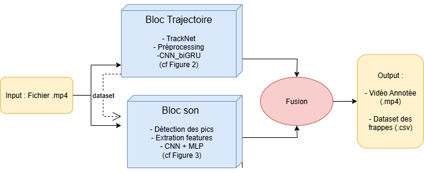
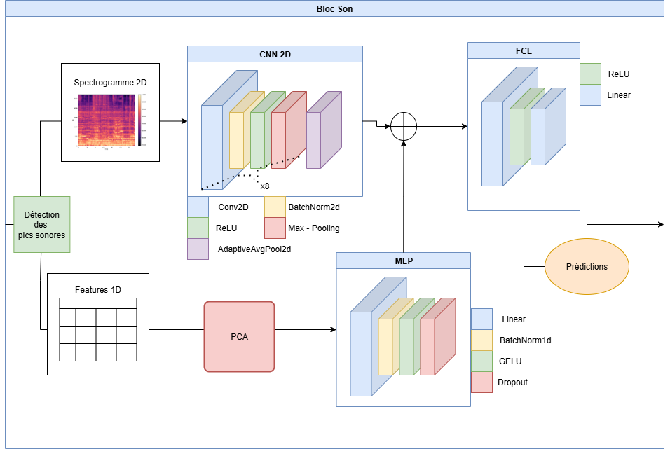
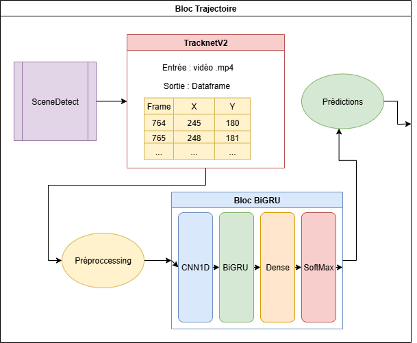

🏸 **BadTrackNet – Intelligent Video Analysis of Badminton Matches**

This project is a complete pipeline for the automatic analysis of **badminton** matches from video, using artificial intelligence to:
- detect the shuttlecock frame by frame,
- analyze the audio spectrum,
- detect hits (strikes),
- predict who is hitting (top or bottom player),
- automatically annotate the video.

It combines the **TrackNetV2** model for shuttlecock tracking with custom-built and trained **computer vision** models for audio spectrum analysis, along with an advanced audio processing pipeline.

## 📁 Structure du projet

```
FFBADMINTON

ffbadminton/
│── README.md                # project presentation
│── requirements.txt         # Python dependencies
│── .gitignore              
│── .gitlab-ci.yml           # CI/CD
│
├── 0_ARCHIVE/               # Work of previous interns
│
├── 1_FFBAD/                 # main source code
│   ├── __init__.py
│   └── inference/           # scripts for inference
│       ├── complete_tracking_TrackNetV2.py     # Main pipeline 
│       ├── extract_sons_pipeline.py
│       ├── camera_change.py
│       ├── extract_trajectoire.py
│       ├── modele_que_volant_CNN0.h5
│       ├── strike_cnn_feat_new.pt
│       └── TrackNetV2/
│           ├── 3_in_1_out
│           └── three_in_three_out
│               └── predict3.py
│   
│   
├── 2_vidIN/                # dir input video
│   
├── 2_vidOUT/               # dir output

```

## ⚙️ Technologies utilisées

- Python 3.9+
- PyTorch & TensorFlow (modèles deep learning)
- OpenCV, librosa, scikit-learn, pandas, matplotlib
- TrackNetV2 (shuttlecock detection)
- moviepy (audio extraction)
- CNN + RNN

## 🔧 Installation and creation of a Python virtual environment

Create the Python virtual environment

```bash
python -m venv .venv
```

Environment activation

```bash
.venv\Scripts\Activate.ps1
```

Install the required dependencies:

```bash
pip install -r requirements.txt
```


## 🚀 Running the main script

### From a local video:

```bash
python complete_tracking_TrackNetV2.py \
  --inputs_path /path/to/2_vidIN/videoNAME.mp4 \
  --outputs_path /path/to/2_vidOUT
```

The script :
1. Downloads the video if needed
2. Generates a reference frame
3. Applies TrackNetV2 on valid scenes
4. Extracts audio signals
5. Extracts features and audio spectrograms
6. Applies CNN and GRU models
7. Detects hits (strikes)
8. Saves the results and an annotated video

## 📦 Main components

- `complete_tracking_TrackNetV2.py`:
  - Script entry point
  - Handles videos and the TrackNet model
  - Predictions using shuttlecock trajectories and audio peak classification
  - Fusion of predictions
  - Final video annotation

- `extract_sons_pipeline.py`:
  - Audio extraction, signal processing, and audio peak detection
  - Extraction of audio features (ZCR, MFCC, spectral flux, spectrogram, etc.)

- `extract_trajectoire.py`:
  - Preprocessing and interpolation of shuttlecock trajectories
  - Formatting for the sequential model (CNN1D + GRU)

## ✅ Generated results

- `*_predict.mp4`: video with shuttlecock tracking points
- `*_annotated.mp4`: video annotated with hits (top / bottom) + shuttlecock trajectories
- `*_df_predict.pkl`: DataFrame of hit predictions

## 📊 Models used

| Composant        | Modèle                        | Emplacement                             |
|------------------|-------------------------------|-----------------------------------------|
| Tracking volant  | TrackNetV2 (Keras)            | `TrackNet/TrackNetv2-master/model906_30.h5` |
| Détection frappe | CNN + features audio (PyTorch)| `strike_cnn_feat_new.pt`                |
| Type de frappe   | GRU + trajectoires (Keras)    | `modele_que_volant_CNN0.h5`             |

## 🖼️ Pipeline diagram

Here is a visual overview of the complete pipeline:



Here are the detailed sub-modules:

- **Bloc audio**  
  

- **Bloc trajectoire**  
  

## 🏸 Example Annotated Video

After running the **BadTrackNet** pipeline, an annotated video is generated. It shows:
- Shuttlecock trajectory detected by **TrackNetV2**
- Hits detected for top/bottom player
https://github.com/user-attachments/assets/bc95a7cd-5432-4643-b930-1be8fdfd55cb
This video demonstrates shuttlecock tracking and automatic hit annotation.

## 📎 Notes

- The system is sensitive to the camera angle: it automatically detects scenes with a standard angle.
- The video must include an audio track.
- Models should be placed at the specified paths or adapted in the code.
- The video should be at least 3 minutes of actual gameplay.

## 🙌 Credits

Developed by Mateo LORENTE and Rehyann BOUTEILLER  
Uses TrackNetV2: https://github.com/cehsan/TrackNetV2
